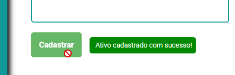

# Projeto Full Stack - ReactJS + API PHP + SQLite

## Asset Stock

O Asset Stock, é um software gerenciador de estoque de ativos eletrônicos de uma empresa.
Nele o usuário pode cadastrar ativos no banco de dados, listar os ativos cadastrados, editar e excluir os ativos.
Software intuitivo, fácil de usar e prático.

# Tecnologias

## Front-end

- ReactJS.

## Back-end

- API - PHP.
- Banco de Dados - SQLite3.

## Bibliotecas

- AXIOS - Requisições HTTP.

# Requisitos

- Node.js e NPM - Para instalação dos pacotes.
- XAMPP (ou algum outro servidor local) - Para rodar a API que é em PHP.

# Rodar projeto localmente

## Instalação de pacotes

Após o download do projeto, você precisará instalar os pacotes necessários para rodá-lo.<br>
Na pasta **AssetsStock** `C:\dev\AssetsStock`, utilize o seguinte comando:

```
npm install
```

## Rodar o front

Em **AssetsStock** `C:\dev\AssetsStock`, utilize o seguinte comando para rodar a aplicação React:<br>

```
npm run dev
```

## Rodar o back

Utilizando o **XAMP**, mova a pasta **_back_** para a pasta **_htdocs_**.<br>
Exemplo:

```
C:\xampp\htdocs\back
```

Ligue o servidor e verifique se está rodando na porta 80 (porta padrão).


**Nota¹:** O servidor deve está rodando na porta 80, pois é lá que está sendo feita a requisição HTTP **_(http://localhost:80/back/)_**.

**Nota²:** É necessário que mova a pasta **_back_** para a pasta **_htdocs_** do **XAMPP**, pois é assim que irá rodar a API em PHP. Caso tenha outro servidor local para rodar PHP, você pode estar utilizando.

# Instruções





